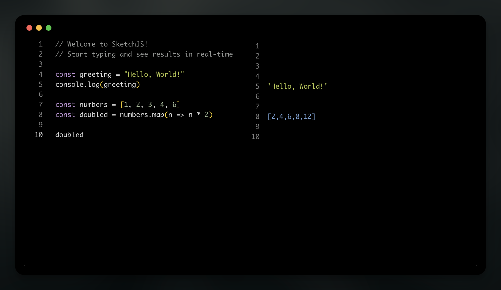

# SketchJS

> An open-source JavaScript/TypeScript playground for your desktop


A modern, lightweight desktop application for testing JavaScript and TypeScript snippets with real-time execution.



## ✨ Features

- 🚀 Live execution with line-aligned output
- 📝 Monaco editor with full IntelliSense
- 🎯 TypeScript support with type checking
- 💾 Auto-save with persistent storage
- ⚙️ Configurable settings (Cmd+,)
- 🎨 Beautiful themes
- ⚡ Small bundle (~3MB)

## 🚀 Quick Start

```bash
# Install dependencies
pnpm install

# Run in development
pnpm tauri:dev

# Build for production
pnpm tauri:build
```

## 🏗️ Tech Stack

- **Desktop**: Tauri v2
- **Frontend**: React + TypeScript
- **Editor**: Monaco Editor
- **UI**: Ark UI + Tailwind CSS v4
- **State**: Zustand + Tauri Store

## 📝 License

MIT License - see [LICENSE](LICENSE) file for details.

---

**Made with ❤️ for the developer community**
